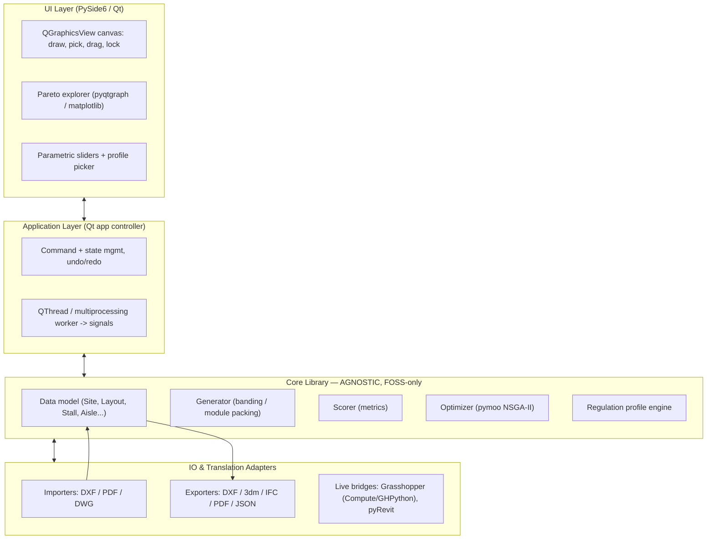

# Parking Layout Generator — Initial Plan & Architecture Brief

*A real-time, interactive, multi-objective parking layout solver. Build target: Claude Code.*

---

## 0. How to read this document

This is the master brief for a from-scratch build. It is written to be handed to Claude Code and worked through **phase by phase** (see §15). Two principles govern everything:

1. **The core is agnostic.** The geometry + solver library depends only on free, open-source packages and knows nothing about Rhino, Revit, AutoCAD, or any UI. Everything CAD-specific lives in thin *adapter* modules behind a stable interface.
2. **One native data model is the contract.** Every importer writes into it; every exporter reads from it; the UI renders it; the solver mutates it. Get this model right early (§6) and the rest is plumbing.

Build the **walking skeleton first** (Phase 0): import a boundary → generate one trivial 90° layout → see it → export DXF, end to end. Only then add angles, optimization, special stalls, and more exporters.

---

## 1. Vision

A standalone desktop application that takes any 2D site boundary (drawn, or selected from an imported DWG/DXF/PDF underlay) and generates dense, regulation-compliant parking layouts in real time. The user steers the result: the solver *proposes* drive aisles, standard/ADA/EV stalls and entrances; the user moves, locks, adds, and deletes them; the solver re-solves around what's locked. A multi-objective optimizer explores the design space and presents a Pareto front of candidate layouts the user can browse, compare, and adopt. Results export to Rhino, Revit, AutoCAD and PDF.

Conceptually this is the TestFit parking-solver category: not one clever algorithm, but a fast **module-packing generator** wrapped in **interactive editing** and **evolutionary search**, all driven by a **swappable rulebook**.

---

## 2. Scope

**In scope for v1**

- Arbitrary 2D boundary: polygon, polyline, arcs/splines (tessellated), holes/islands and interior obstacles (planters, columns, ramps, existing buildings).
- Standard (90°) and fishbone/angled (45/60/75°) layouts, one-way and two-way aisles.
- Parametric stall and aisle dimensions, driven by a country/jurisdiction **regulation profile**.
- Auto-placement of standard, ADA/accessible (incl. van), and EV stalls plus entrances.
- Move / lock / add / delete of any element, with constrained re-solve.
- Multi-objective optimization (NSGA-II) with an interactive Pareto-front explorer.
- Import: DXF (entity pick), PDF (raster underlay + scale calibration), DWG (via converter — see §12).
- Export: DXF, Rhino `.3dm`, PDF documentation, IFC; native JSON project format. Grasshopper + Revit adapters.

**Out of scope for v1** (note, don't build)

- Multi-level / ramped parking decks, slope/grade modelling, drainage.
- Straight-skeleton / medial-axis aisle generation (explicitly not needed — banding is enough).
- Cloud/multi-user, account systems.
- Automated code-compliance certification (the tool *assists*; it does not certify).

---

## 3. Technology stack decision

### 3.1 Language: **Python** (primary recommendation)

Rationale, weighed against C#:

- The single most distinctive feature you asked for — *Pareto-front multi-objective optimization across generations* — is a solved problem in **pymoo** (NSGA-II/III, R-NSGA, visualization built in). There is no comparably mature, free .NET equivalent.
- The geometry stack you'd reach for (Shapely, GDAL/OGR, `pyclipper`, `ezdxf`) is first-class in Python and matches the "use GDAL, no custom geometry algorithms" constraint.
- Agnostic interop is *cleaner* from Python than people expect: **rhino3dm** writes `.3dm` with no Rhino install; **ifcopenshell** writes IFC for the Revit path; **ezdxf** writes DXF.
- It matches your existing toolchain (GhPython, Python scripting, Rhino/Grasshopper), so the translation layers are low-friction to extend.

**Where C# would have been easier, and how we handle it:** native Revit and Rhino/Grasshopper APIs are .NET-only. We deliberately do *not* put the core there. Instead the core stays Python and CAD integration happens through (a) neutral files (`.3dm`, IFC, DXF, our JSON) and (b) small .NET/GHPython *adapter* scripts that live outside the core. This keeps the heart portable and free, exactly per the brief.

> If you later decide native Revit family placement is a hard requirement and want a single-language stack, the fallback is a C#/Avalonia rewrite of the UI talking to the same neutral JSON — but that's a deliberate Phase-5+ decision, not a v1 constraint.

### 3.2 UI: **PySide6 / Qt — single language, one process** (decided)

The whole app is Python + **PySide6 (Qt 6)**. No JavaScript, no web backend, no IPC boundary, no two-runtime bundling — one language end to end, which is the simplest thing to build, debug, and ship, and the cleanest target for Claude Code to work in one idiom.

- **Canvas:** **QGraphicsScene / QGraphicsView**. This is a real CAD-style scene graph with indexed hit-testing, item transforms, and built-in pan/zoom (`ScrollHandDrag`, wheel zoom anchored under the cursor). Each stall is a `QGraphicsItem` subclass carrying `ItemIsMovable | ItemIsSelectable`; `itemChange` handles snapping and write-back to the model; a `locked` visual state maps straight to the model's `locked` flag. At parking-lot scale (hundreds–low-thousands of stalls) this is comfortably fast.
- **Underlay:** `QGraphicsPixmapItem` for rasterized PDF/image backdrops; `QGraphicsPathItem` for picked vector linework.
- **Charts / Pareto explorer:** **pyqtgraph** for the live, interactive scatter that streams during optimization (fast, Qt-native, good selection/brushing). For the parallel-coordinates view over >3 objectives, embed **pymoo's built-in matplotlib plots** (`Scatter`, `PCP`) via `FigureCanvasQTAgg`, or draw a custom pyqtgraph PCP. Start with pyqtgraph + embedded matplotlib; no third charting stack needed.
- **Packaging:** **PyInstaller** or **Nuitka** (or **briefcase**) → a single standalone installer per OS. No shell/webview dependency.

**Coordinate discipline (important):** keep the model in real-world **metres**; never let model code see screen coordinates. Apply one view transform at the `QGraphicsView` boundary, and flip the Y axis there (Qt scene-Y points down, CAD-Y points up). All geometry, the generator, and exporters stay in clean world units.

### 3.3 Library shortlist

| Concern | Library | Notes |
|---|---|---|
| 2D geometry, boolean ops | **Shapely** (GEOS) | union/difference/intersection, buffering, containment |
| Robust polygon offsetting | **pyclipper** (Clipper2) | use for inward offsets at concave corners where `buffer` is fragile |
| CRS / raster / vector IO | **GDAL/OGR** (`fiona`, `rasterio`) | as requested; also GeoPackage for native storage option |
| DXF read/write, entity pick | **ezdxf** | reads LINE/LWPOLYLINE/ARC/CIRCLE/SPLINE; writes layered DXF |
| PDF underlay render + vector extract | **PyMuPDF** (`fitz`) | rasterize page; can also pull vector paths |
| DWG → DXF | **ODA File Converter** (invoked) / **libredwg** | DWG is proprietary; see §12.3 caveat |
| Multi-objective optimization | **pymoo** | NSGA-II/III, constraint handling, built-in viz |
| Numerics | **numpy**, optionally **scipy** | vectorized stall packing, transforms |
| Rhino `.3dm` export | **rhino3dm** | pure-python, no Rhino install |
| IFC export (Revit path) | **ifcopenshell** | neutral BIM exchange |
| PDF documentation export | **reportlab** or **PyMuPDF** | title block, legend, stall schedule |
| GUI toolkit + CAD canvas | **PySide6** (Qt 6, QGraphicsView) | scene graph, hit-testing, pan/zoom, draggable items |
| Interactive Pareto charts | **pyqtgraph** (+ embedded **matplotlib** for pymoo PCP) | live scatter streaming, parallel coordinates |
| Threading / async solve | **QThread** + **multiprocessing** | keep heavy solve/optimizer off the UI thread |
| Desktop packaging | **PyInstaller** / **Nuitka** / **briefcase** | single standalone installer, no webview |

---

## 4. Architecture (layered)



### Suggested repository structure

```
parking-solver/
  core/                      # agnostic, pip-installable, fully unit-tested
    model.py                 # dataclasses: Site, Obstacle, Entrance, Stall, DriveAisle, Layout, Metrics
    regulations/
      engine.py              # load/validate profile, derive module geometry
      profiles/
        generic_eu.yaml
        bulgaria.yaml
        us_generic.yaml
    generator.py             # banding / module-packing single-layout generator
    scorer.py                # metrics from a Layout
    optimizer.py             # pymoo problem + NSGA-II runner -> ParetoSet
    geometry/                # helpers: rotate-to-axis, offset (pyclipper), tessellate arcs
  io/
    import_dxf.py            # entity selection -> boundary chaining
    import_pdf.py            # rasterize + 2-point scale calibration
    import_dwg.py            # ODA/libredwg -> dxf -> import_dxf
    export_dxf.py
    export_3dm.py            # rhino3dm
    export_ifc.py            # ifcopenshell
    export_pdf.py            # documentation sheet + schedule
    project_io.py            # native JSON read/write (the contract)
  bridges/
    grasshopper/             # GHPython component reading native JSON  (+ optional Rhino.Compute)
    revit/                   # pyRevit/Dynamo script placing families from native JSON
  app/                       # Qt app controller, command/undo stack, worker threads
    controller.py            # owns the project state; orchestrates core <-> ui
    workers.py               # QThread/multiprocessing wrappers: generate, optimize -> Qt signals
  ui/                        # PySide6
    main_window.py           # menus, docks, toolbars
    canvas/                  # QGraphicsView, scene, QGraphicsItem subclasses (stall, aisle, boundary, underlay)
    panels/                  # parametric sliders, profile picker, metrics readout
    pareto/                  # pyqtgraph scatter + embedded matplotlib PCP, click-to-load
  tests/
```

---

## 5. Core domain & data model

These dataclasses are the spine. Keep them serializable (this *is* the native project format, §13.4).

```python
class StallType(Enum):
    STANDARD; COMPACT; ACCESSIBLE; ACCESSIBLE_VAN; EV; EV_ACCESSIBLE; MOTORCYCLE

@dataclass
class Site:
    boundary: Polygon                 # outer site, real-world units (metres)
    obstacles: list[Polygon]          # holes/islands/columns/existing structures
    entrances: list[Entrance]         # site access + building entrances (for walk distance)
    setbacks: dict[str, float]        # per-edge or global
    underlay: Underlay | None         # raster/vector backdrop + transform

@dataclass
class Stall:
    polygon: Polygon                  # the actual footprint (parallelogram if angled)
    type: StallType
    angle: float                      # 90 = perpendicular; 45/60/75 = fishbone
    locked: bool = False              # user-fixed; solver must respect
    source: Literal["generated","manual"] = "generated"

@dataclass
class DriveAisle:
    centerline: LineString
    width: float
    direction: Literal["one_way","two_way"]

@dataclass
class Layout:
    stalls: list[Stall]
    aisles: list[DriveAisle]
    entrances: list[Entrance]
    metrics: Metrics
    params: LayoutParams
    profile_id: str
```

**Core service interfaces** (stable; everything else depends only on these):

```python
generator.generate(site, profile, params, fixed: FixedElements) -> Layout
scorer.score(layout, site, profile) -> Metrics
optimizer.run(site, profile, objectives, fixed, budget) -> ParetoSet   # streams generations
```

`FixedElements` carries the locked stalls/entrances/aisles. This is what makes the human-in-the-loop work (§9): the generator treats locked stalls as immovable inputs (counted, and acting as obstacles for everything else).

---

## 6. The solver

You explicitly don't want straight skeletons. The right model is **module packing by banding**, which is how this whole product category works and which Shapely handles directly.

### 6.1 The parking module

A layout is tiled from **modules**: a drive aisle flanked by one (single-loaded) or two (double-loaded) rows of stalls. A module's gross width is a function of the regulation profile and parameters:

```
module_width = aisle_width(angle, one/two-way)  +  n_rows * stall_depth_projection(angle)
along_aisle_pitch = stall_width / sin(angle)          # 90° -> pitch == stall_width
stall_depth_projection = stall_length*sin(angle) + stall_width*cos(angle)   # for angled cells
```

The `regulations.engine.module_geometry(...)` function owns this math so the generator never hardcodes dimensions.

### 6.2 The banding algorithm (axis-align trick)

Do **not** band obliquely. Rotate the whole problem so the chosen aisle direction is horizontal, band trivially in axis-aligned space, then rotate back. This collapses the hard case to the easy one.

```
generate(site, profile, params, fixed):
    1. work = offset_inward(site.boundary, setbacks)              # pyclipper
       work = work - union(site.obstacles + fixed.as_obstacles)  # Shapely difference
    2. R   = rotation(-params.orientation, origin=work.centroid)  # aisle dir -> +x
       work_r = R(work)
    3. mod = profile.module_geometry(params.layout_type, params.angle,
                                     params.stall_width, params.one_or_two_way)
    4. # pack horizontal bands across the bbox
       y = work_r.bounds.ymin
       while y + mod.width <= work_r.bounds.ymax:
           band = box(xmin, y, xmax, y + mod.width) & work_r
           for row in band.rows(mod):                  # top/bottom of the aisle
               x = row.xmin
               while x + mod.pitch <= row.xmax:
                   cell = stall_cell(x, y, params.angle, profile)
                   if cell.within(work_r) and not cell.intersects(obstacles):
                       stalls.append(cell)             # else: partial -> drop
                   x += mod.pitch
           aisles.append(aisle_centerline(band, mod))
           y += mod.width
    5. layout = R.inverse(stalls, aisles)              # rotate back to world
    6. layout += fixed.locked_stalls
       place_special_stalls(layout, site, profile)     # §7
       ensure_circulation(layout, site, profile)       # §7
    7. layout.metrics = scorer.score(layout, site, profile)
       return layout
```

This is fast (hundreds–low-thousands of Shapely ops), which is what makes the live parametric preview feel instant. **Standard vs fishbone is the same code**, differing only in `angle`, `pitch`, `module_width`, and one-way/two-way aisle width — all from the profile. That keeps "the user can change fishbone and standard layouts, parametrically" a single code path.

### 6.3 Robustness notes
- Use **pyclipper/Clipper2** for inward offsets; Shapely's `buffer(-d)` can misbehave at sharp concave corners and on near-degenerate slivers.
- Tessellate arcs/splines to polylines at a tolerance before any boolean op; keep the original curves only for re-export fidelity.
- Drop partial stalls that don't fully `within(work)`; optionally allow a configurable bumper/overhang tolerance from the profile.

---

## 7. Special stalls & circulation

- **ADA / accessible:** count required from the profile's table (a step function of total stalls; van-accessible subset). Placement objective: minimize accessible-route distance to the nearest building entrance, on the shortest aisle run, grouped. Convert nearest standard stalls to `ACCESSIBLE`/`ACCESSIBLE_VAN`, widening to include the access aisle from the profile.
- **EV:** count/ratio from the profile (this varies a lot by jurisdiction — keep it data-driven). Placement bias: near entrances and a user-marked electrical/service point.
- **Circulation:** verify aisle connectivity (graph over aisle centerlines), connect bands with cross-aisles where gaps exist, flag dead-ends and require a turn-around or connection. Connect the aisle graph to each site entrance. Keep this a *checker + minimal fixer*, not a full traffic simulation, for v1.

---

## 8. Parametric control

Expose as live controls, all reading the active profile for legal min/max:
`orientation (sweep)`, `layout_type (standard/fishbone)`, `angle (45/60/75/90)`, `one_way/two_way`, `stall_width`, `stall_length`, `compact_allowed + ratio`, `aisle_width override`. Changing any of these triggers the sub-second single-layout regenerate (§14).

---

## 9. Interaction & locking (human-in-the-loop)

The solver is **not** a black box; it must accept fixtures. Interaction model:

- **Select / move / rotate** any stall or entrance on the canvas.
- **Lock / unlock** elements. Locked elements become part of `FixedElements`: counted, drawn, and acting as obstacles so generated stalls flow around them.
- **Add / delete** stalls manually (`source="manual"`), draw custom aisles, mark entrances.
- **Re-solve** regenerates only the *unlocked* region around the locked set. Implement as: subtract locked footprints + a clearance buffer from `work`, regenerate, union results back.

This is the mechanism behind "the app proposes, the user moves and locks, then it iterates."

---

## 10. Regulation profiles (the swappable rulebook)

One declarative file per jurisdiction (YAML or TOML), selected at runtime. Different countries = different files; users can clone and edit. This is what makes road/stall sizing and ADA/EV rules data-driven rather than hardcoded.

```yaml
# profiles/generic_eu.yaml  — ILLUSTRATIVE DEFAULTS, verify against local code before use
id: generic_eu
units: metres
stalls:
  standard:    {width: 2.50, length: 5.00}
  compact:     {width: 2.30, length: 4.50, max_ratio: 0.30}
  accessible:  {width: 3.60, length: 5.00, access_aisle: 1.20}
  accessible_van: {width: 3.90, length: 5.00, access_aisle: 1.50}
  ev:          {width: 2.50, length: 5.00}
aisles:                       # width by angle and direction
  "90":  {two_way: 6.00, one_way: 6.00}
  "75":  {one_way: 5.50}
  "60":  {one_way: 4.50}
  "45":  {one_way: 3.50}
fire_lane: {min_width: 3.50, max_dead_end: 50.0}
accessible_count:             # step function: provide N accessible per total
  table: [[25,1],[50,2],[75,3],[100,4],[150,5]]   # >100 -> +1 per 50 (rule continues)
  van_fraction: 0.125
ev:
  required_ratio: 0.10        # jurisdiction-dependent; edit
  ev_ready_ratio: 0.20
overhang_allowance: 0.60      # curb overhang reduces effective depth
```

> ⚠️ The numbers above are **placeholders to define the schema**, not legal values. Ship `generic_eu`, a **Bulgaria** profile (your home jurisdiction — to be populated from Наредба № РД-02-20-2 / ЗУТ provisions), and a `us_generic` profile, each clearly flagged "verify before permitting." The engine validates the file on load and derives all module geometry from it.

---

## 11. Multi-objective optimization & Pareto front

This is the headline feature. Use **pymoo**.

**Decision variables:** `orientation` (continuous, or a discrete sweep), `layout_type`, `angle`, `one_way/two_way`, `stall_width` (bounded by profile), `band offset/phase`, `compact_ratio`.

**Objectives (conflicting, minimize/maximize):**
- maximize total stall count
- minimize gross area per stall (efficiency; ~25–30 m²/stall is a good surface-lot reference)
- maximize ADA/EV compliance margin
- minimize mean/max walking distance to entrances
- minimize dead-ends / maximize circulation quality
- maximize retained landscape/green area

**Engine:** NSGA-II for ≤3–4 objectives; NSGA-III or reference-direction methods for more. Locked elements pass through as fixed constraints so optimization respects user intent.

**Visualization & UX:**
- Pareto scatter (2–3 objectives) in **pyqtgraph**, and **parallel-coordinates** (pymoo's `PCP` via embedded matplotlib) for >3.
- **Stream generations** to the UI via **Qt signals** from the optimizer worker thread: the front visibly evolves each generation — this is your "going through many iterations across generations" requirement, made visible.
- Click any Pareto point → load that `Layout` on the canvas.
- **Auto advantages/disadvantages:** for the selected candidate, compute deltas vs the Pareto median and verbalize ("+38 stalls, −1.4 m²/stall vs median, but +22 m mean walk distance; ADA compliant, EV at 8% < 10% target"). This turns the front into a decision aid, not just a chart.

Run the optimizer in a **separate process** (`multiprocessing`, so pymoo isn't throttled by the GIL), with a `QThread` draining its result queue and re-emitting each generation as a Qt signal on the main thread. The deterministic single-layout generator (§6) stays on the fast path for live editing.

---

## 12. Import & underlay

### 12.1 DXF (primary import)
`ezdxf` reads entities. UI workflow: render entities on the canvas → user **picks the curves** that bound the site (and separately the obstacles) → a **chaining** routine assembles selected LINE/LWPOLYLINE/ARC/SPLINE into closed loops within a snap tolerance (handle ordering, gaps, arc/spline tessellation). Also support **"just draw the polygon"** on top of the underlay — same boundary either way.

### 12.2 PDF underlay + scale calibration
`PyMuPDF` rasterizes the chosen page to an image placed as a backdrop. **Calibrate scale** with the classic two-point method: user clicks two points of known real distance and enters it → derive the pixel→metre transform so all drawn/derived geometry is in real units. (Bonus: PyMuPDF can also extract vector paths from vector PDFs for direct picking.)

### 12.3 DWG (caveat — flag this honestly)
DWG is proprietary; there is no clean pure-FOSS reader. Practical options, in order:
1. Bundle/invoke **ODA File Converter** (free) to convert DWG→DXF, then reuse the DXF path. Most reliable.
2. **libredwg** (`dwg2dxf`) — fully FOSS but maturity varies by file; acceptable as a fallback.
3. **v1 ships DXF + PDF; DWG import is "convert to DXF first"** if neither dependency is acceptable.

Pick the dependency posture explicitly during Phase 4; don't let it block earlier phases.

---

## 13. Export & interoperability

Every exporter reads the native model. Keep the core clean; these are adapters.

### 13.1 AutoCAD / DXF
`ezdxf` writes a layered DXF (layer per stall type, aisles, entrances, dimensions, schedule block). DWG out via the same ODA converter in reverse if needed.

### 13.2 Rhino `.3dm`
`rhino3dm` writes stalls as curves/hatches and aisles as polylines on typed layers — **no Rhino install required**. This is the clean agnostic Rhino path.

### 13.3 Grasshopper
Keep core agnostic; provide a **GHPython component** that reads the native JSON and rebuilds geometry inside GH — zero coupling. Optional richer live link via **Rhino.Compute / Hops** if you want push-button round-tripping later.

### 13.4 Native JSON project format (the contract)
A single self-describing file: boundary, obstacles, entrances, all stalls (type/angle/locked/source), aisles, profile id, params, metrics, underlay reference + transform. **Every importer targets it and every exporter/bridge sources it.** This is what makes "core + translation layer" real.

### 13.5 Revit
Hardest, because the Revit API is .NET. Paths, best-first for your setup:
1. **pyRevit / Dynamo importer** that reads the native JSON and places parking-stall **families** from your existing library at the exported transforms. Given your Revit family-library work, this is the most useful and practical Revit route.
2. **IFC** via `ifcopenshell` (stalls as generic models / parking spaces) → import to Revit. Vendor-neutral fallback.
3. **DXF** import as linework if all else fails.

### 13.6 PDF documentation
`reportlab`/PyMuPDF render a permit-style sheet: layout drawing, north arrow, legend, and a **stall schedule** (counts by type, efficiency, ADA/EV provided vs required, walk distances).

---

## 14. Real-time architecture

Two distinct speeds, kept separate:

- **Fast path (live):** the deterministic single-layout generator (§6) and incremental scoring. Parametric sliders, drag, lock → sub-second regenerate of the affected region. This is the "real-time feedback" the product lives or dies on. **Debounce** slider input with a `QTimer` (~50–100 ms) so a drag fires one regenerate, not dozens. Start it on the main thread; if large sites stutter, move it to a `QThread`.
- **Slow path (exploration):** pymoo NSGA-II in a separate process, with a `QThread` draining its queue and re-emitting each generation as a Qt signal. "Real-time" here means *visible progress*, not instant.

**Qt threading discipline (the one rule that bites):** all widget/scene access happens on the main thread. Workers never touch `QGraphicsItem`s — they compute and emit results via signals; slots on the main thread apply them to the scene. Get this wrong and you get random crashes or a frozen UI. Wrap the core's plain-Python returns (dataclasses) in signals; never pass Qt objects into a worker.

Never block the UI on the slow path; never route a slider drag through the optimizer.

---

## 15. Phased roadmap (with acceptance criteria)

**Phase 0 — Walking skeleton.** Repo scaffold; data model; load one profile; import DXF + entity-pick → boundary (and "draw polygon"); generate one 90° double-loaded layout via banding; render with pan/zoom + live stall count; export DXF.
*Done when:* a real DXF site → a generated layout on screen → a valid DXF out, no overlaps, all stalls inside the boundary.

**Phase 1 — Parametric solver.** Angles 45/60/75/90, one/two-way, fishbone; obstacles/islands; setbacks; partial-stall trimming; multiple entrances; live parametric sliders; basic circulation/connectivity check.
*Done when:* changing angle/width/orientation re-solves <1 s and respects obstacles + setbacks; module geometry comes entirely from the profile.

**Phase 2 — Special stalls + interaction.** ADA placement + count table; EV placement + ratio; select/move/lock/unlock; manual add/delete; custom aisles; constrained re-solve around locked elements.
*Done when:* locked stalls survive re-solve and act as obstacles; ADA/EV counts match the profile; manual edits persist.

**Phase 3 — Multi-objective optimization.** pymoo NSGA-II; objective selection; Pareto scatter + parallel coords; click-to-load; auto advantages/disadvantages; generation streaming; async worker.
*Done when:* a run yields a browsable non-dominated set; selecting a point loads it; the front updates live during the run.

**Phase 4 — Import polish + exporters.** PDF underlay + 2-point calibration; DWG via converter; exporters for `.3dm`, IFC, PDF documentation, native JSON; Grasshopper GHPython adapter; pyRevit importer.
*Done when:* round-trip DXF→solve→`.3dm`/IFC/PDF verified in Rhino/Revit/a PDF viewer; GH component rebuilds geometry from JSON.

**Phase 5 — Productionize.** Project save/load (native JSON), undo/redo, multi-profile (EU/BG/US), reporting, installer (PyInstaller/Nuitka), test coverage, docs.

---

## 16. Testing strategy

- **Golden geometry tests:** known polygons → known max-stall counts (e.g. a clean rectangle at fixed dims).
- **Property tests:** no stall–stall overlaps; every stall `within(boundary − obstacles)`; every stall meets the profile's min dimensions; locked stalls always present post-solve.
- **Regulation validation:** each profile file validates against a schema; module geometry derivations unit-tested per angle.
- **Metric regression:** snapshot metrics on reference sites to catch solver drift.
- **IO round-trips:** DXF→model→DXF and model→`.3dm`/IFC→reopen, asserting geometry/layers survive.

---

## 17. Risks & open questions

| Risk | Mitigation |
|---|---|
| DWG reading is the weakest FOSS link | Depend on ODA File Converter; ship DXF/PDF first; DWG as "convert to DXF" |
| Offsetting fails at sharp concave corners / slivers | Use pyclipper/Clipper2, not Shapely buffer, for inward offsets |
| MOO too slow for "real-time" | Split fast deterministic gen (live) from async MOO (explore) |
| Constrained re-solve complexity around locked sets | Subtract locked + clearance from work-area; regenerate region; union back |
| Regulatory accuracy / liability | Ship clearly-flagged illustrative profiles; user-editable; tool assists, doesn't certify |
| Curve chaining from picked DXF entities (gaps, order, arcs) | Tolerance-based chaining + arc/spline tessellation; manual "close loop" fallback |
| Revit native placement is .NET-only | pyRevit importer from native JSON + IFC fallback; keep core out of .NET |
| Qt worker touches the scene from a thread → crash/freeze | Strict rule: workers return plain dataclasses via signals; only main-thread slots mutate `QGraphicsItem`s |

**Open questions to resolve before Phase 1:** ~~UI route~~ — **decided: PySide6/Qt.** First three profiles' authoritative sources (esp. Bulgaria dimensions from Наредба № РД-02-20-2)? Is compact parking in scope for v1 or a profile flag only? Single-level only confirmed?

---

## 18. Suggested first Claude Code session

1. Scaffold the repo (§4), set up `core/` as an installable package with tests.
2. Implement `model.py` and `project_io.py` (native JSON round-trip) — the contract first.
3. Implement `regulations/engine.py` + `generic_eu.yaml`, with `module_geometry` unit-tested.
4. Implement `generator.generate` for the 90° double-loaded case (banding, §6.2) with property tests.
5. Implement `import_dxf` (entity pick → boundary) and `export_dxf`.
6. Stand up the minimal **PySide6** window: a `QGraphicsView` canvas with pan/zoom, "Open DXF" + "Draw polygon", stall rendering, a live count label, and "Export DXF" — closing the Phase 0 loop. Keep all core calls returning plain dataclasses; the window only renders them.

Keep `core/` free of any UI or CAD-app import for the entire project. If a dependency isn't on the §3.3 list, question it.
